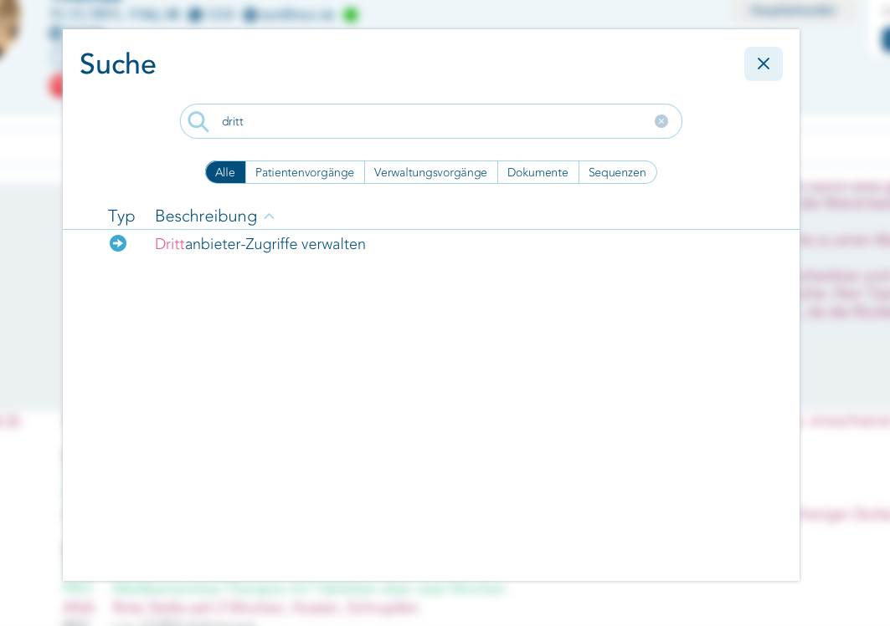
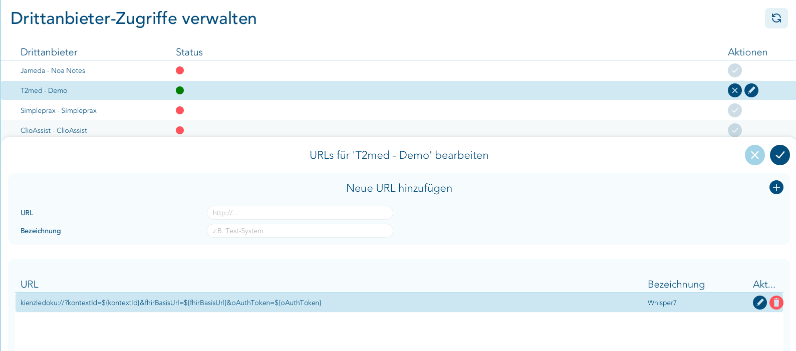

# Kienzledoku 1.3.0

[](https://www.youtube.com/watch?v=6l1U047NSwg)

**Video:** [Lokaler KI-Dokumentationsassistent für die Arztpraxis (kostenlos) – T2med](https://www.youtube.com/watch?v=6l1U047NSwg)

Kienzledoku erstellt aus dem Arzt-Patienten-Gespräch einen strukturierten
Dokumentationsentwurf und übernimmt ihn nach ärztlicher Prüfung kontrolliert in
die aktuell in T2med geöffnete Patientenakte. Mikrofonaufnahme,
Spracherkennung, Sprechertrennung und LLM-Verarbeitung laufen lokal auf dem
Arbeitsplatz oder innerhalb des Praxisnetzes. T2med-Zugangsdaten werden nicht in
Projektdateien gespeichert.

> [!IMPORTANT]
> Kienzledoku 1.3.0 ist ein Entwicklungs- und Integrationsstand, kein
> zertifiziertes Medizinprodukt. Die erzeugte Dokumentation ist immer ein
> Entwurf und muss vor der Übernahme vollständig ärztlich geprüft werden. Die
> in [Sicherheitsgrenzen](#sicherheitsgrenzen) beschriebenen Einschränkungen
> schließen einen ungeprüften produktiven Einsatz aus.

> [!TIP]
> **Freie Betriebssystemkombination:** Der Client kann auf macOS oder Ubuntu
> 24.04 laufen. Unabhängig davon können LLM, Final-Block-ASR und Diarisierung
> auf einem Apple-Silicon-Mac oder einem Ubuntu-/NVIDIA-System laufen – lokal
> auf demselben Rechner oder über das Praxisnetz. Für den Mehrplatzbetrieb
> wird ein dedizierter Ubuntu-/NVIDIA-Server empfohlen.

> [!WARNING]
> **Demo-Key: höchstens 100 FHIR-Requests pro APS-Serverprozess.** Jeder
> Patienten-Read, Encounter-Read und Write zählt einzeln; damit sind nicht 100
> vollständige Dokumentationsvorgänge gemeint. Ist das Kontingent
> ausgeschöpft, muss der T2med-/APS-Serverprozess neu gestartet werden, bevor
> der öffentliche Demo-Key wieder verwendet werden kann. Für den regelmäßigen
> Betrieb sollte ein eigener T2med-API-Schlüssel eingerichtet werden.

## Funktionsumfang

- automatische Mikrofonaufnahme nach dem Aufruf aus T2med;
- Live-Transkript über einen residenten Final-Block-ASR-Dienst;
- optionale Sprechertrennung mit editierbarem Sprechertranskript;
- erneute Zusammenfassung eines manuell korrigierten Transkripts ohne neue
  Audioaufnahme;
- Fortsetzen einer Aufnahme bei Erhalt des bisherigen Gesprächsverlaufs;
- strikter LLM-Vertrag mit den Feldern Anamnese, Befund, Therapie und
  Prozedere;
- ärztlich editierbare Dokumentationsfelder;
- wahlweise vier strukturierte T2med-Einträge oder ein gemeinsamer
  Freitext-Eintrag;
- atomare Übertragung als FHIR-Transaktion: entweder werden alle Einträge
  übernommen oder keiner;
- Clientinstaller für macOS auf Intel/Apple Silicon und Ubuntu 24.04 LTS auf
  x86_64; der Linux-Client besitzt ein eigenes WebKitGTK-Fenster für X11 und
  Wayland;
- Serverinstaller für Qwen/llama.cpp, Whisper und pyannote wahlweise auf einem
  Apple-Silicon-Mac oder einem Ubuntu-/NVIDIA-System.

Die frühere Entwicklungsbezeichnung **WhisperDoku** erscheint nur noch bei
Herkunft und Rückwärtskompatibilität. Der Projektname und das kanonische
URL-Schema lauten **Kienzledoku** und `kienzledoku://`.

## Ablauf

```text
T2med-Patientenkontext
  → Systemmikrofon
  → Final-Block-ASR
  → optionale Diarisierung
  → lokales LLM
  → validierter Vier-Felder-Entwurf
  → ärztliche Sichtung und Korrektur
  → atomare T2med-FHIR-Transaktion
```

1. In T2med wird ein Patient geöffnet und Kienzledoku über den zugewiesenen
   Drittanbieter-Button gestartet.
2. Kienzledoku lädt den Patienten- und Behandlungskontext und startet die
   Aufnahme.
3. Fertige Sprachblöcke erscheinen während der Aufnahme im Live-Transkript.
4. `Aufnahme stoppen` startet Final-ASR, optionale Diarisierung und die
   Dokumentation durch das LLM.
5. Sprechertranskript und Dokumentationsfelder können geprüft und korrigiert
   werden. `Neu zusammenfassen` sendet nur den korrigierten Text erneut an das
   LLM.
6. `In T2med übernehmen` schreibt die Dokumentation ohne zusätzlichen
   Bestätigungsdialog. Nach erfolgreicher Transaktion wird die lokale Sitzung
   beendet.

## Voraussetzungen

- Ubuntu 24.04 LTS auf x86_64 oder macOS auf Intel-/Apple-Silicon-Hardware;
- Python 3.9 oder neuer;
- T2med mit eingerichteter Drittanbieter-Anbindung und FHIR-Zugriff;
- erreichbare, zu Kienzlefon AI kompatible Dienste für
  - ASR/Final Block, standardmäßig Port `8179`,
  - Diarisierung, standardmäßig Port `8183`,
  - ein OpenAI-kompatibles LLM, standardmäßig Port `8080`;
- ein vom Betriebssystem bereitgestelltes Mikrofon-Eingabegerät.

Für die KI-Serverdienste enthält dieses Repository zwei Alternativen:
[`local-ai-macos`](local-ai-macos/README.md) für Apple Silicon mit mindestens
32 GB Unified Memory sowie [`server-linux`](server-linux/README.md) für Ubuntu
24.04 mit geeigneter NVIDIA-GPU. Beide Clientvarianten können mit beiden
Servervarianten verbunden werden. Modelle sind wegen ihrer Größe nicht im
Repository enthalten; die Serverinstaller laden festgeschriebene Versionen und
prüfen die vorgesehenen Dateien.

## Installation: Client und KI-Server getrennt auswählen

Kienzledoku besteht aus zwei voneinander unabhängigen Teilen:

1. Der **Client** läuft auf dem T2med-Arbeitsplatz, nimmt das Gespräch auf,
   zeigt den Entwurf an und überträgt ihn nach T2med.
2. Die drei **KI-Serverdienste** übernehmen Spracherkennung, optionale
   Sprechertrennung und Dokumentationserstellung.

Client und Server müssen nicht dasselbe Betriebssystem verwenden und müssen
nicht auf demselben Rechner laufen:

| Rolle | macOS | Linux |
| --- | --- | --- |
| **Kienzledoku-Client** | Intel oder Apple Silicon: `install_macos.command` | Ubuntu 24.04 LTS x86_64: `install_linux.sh` |
| **KI-Serverdienste** | Apple Silicon ab 32 GB: `local-ai-macos` | Ubuntu 24.04 mit NVIDIA-GPU: `server-linux` |

Damit sind beispielsweise alle folgenden Kombinationen möglich:

- macOS-Client mit KI-Diensten auf demselben Mac;
- macOS-Client mit einem Linux-/NVIDIA-Server im Praxisnetz;
- Linux-Client mit KI-Diensten auf demselben geeigneten Linux-Rechner;
- Linux-Client mit einem separaten Linux-Server oder einem Apple-Silicon-Mac
  im Praxisnetz.

Für den regelmäßigen Mehrplatzbetrieb wird ein dedizierter
Ubuntu-/NVIDIA-Server empfohlen. Die Clientwahl bleibt davon unabhängig.

### Schritt 1: Kienzledoku-Client installieren

Auf jedem T2med-Arbeitsplatz wird genau eine der beiden Clientvarianten
installiert.

#### Client auf macOS

Der macOS-Client läuft auf Intel- und Apple-Silicon-Macs. Er setzt keine lokale
KI-Installation voraus und kann ebenso einen Linux-Server im Praxisnetz
verwenden:

```bash
git clone https://github.com/thomaskien/kienzledoku.git
cd kienzledoku
./install_macos.command
```

Falls die Ausführungsrechte beim Download verloren gegangen sind:

```bash
chmod +x *.command *.sh
chmod +x local-ai-macos/*.command local-ai-macos/*.sh
./install_macos.command
```

Der Installer legt `Kienzledoku.app` unter `~/Applications` an, registriert das
URL-Schema und fragt den T2med-FHIR-Host sowie die Adressen der drei
KI-Serverdienste ab.

#### Client auf Ubuntu 24.04 LTS

Der Linux-Client läuft auf Ubuntu 24.04 LTS x86_64. Er ist unabhängig von
GNOME oder XFCE sowie von Wayland oder X11. Die KI-Dienste können auf demselben
geeigneten Rechner, auf einem anderen Linux-Server oder auf einem
Apple-Silicon-Mac laufen.

Direkte Installation von GitHub:

```bash
curl -fsSL https://raw.githubusercontent.com/thomaskien/kienzledoku/main/install_linux.sh | bash
```

Der Einstieg per `curl` lädt den vollständigen Quellbaum als temporäres
GitHub-Archiv und führt daraus den Installer aus. Zum Prüfen des gesamten
Quellstands vor der Ausführung kann stattdessen das Repository geklont werden:

```bash
git clone https://github.com/thomaskien/kienzledoku.git
cd kienzledoku
./install_linux.sh
```

Der Installer installiert die benötigten Ubuntu-Pakete mit `sudo`, darunter
Python mit `venv`, Compiler, GTK 4, WebKitGTK 6.0, PortAudio,
XDG-/Desktop-Werkzeuge, Secret Service/gnome-keyring und Benachrichtigungen.
Falls erforderlich, aktiviert er Ubuntu `universe`. Danach baut er den
Fenstercontainer und installiert den Client benutzerbezogen in den
XDG-Verzeichnissen. Modelle oder KI-Serverdienste werden nicht installiert.

Standardmäßig wird nur `kienzledoku://` registriert. Frühere URL-Schemata
können ausdrücklich zusätzlich aktiviert werden:

```bash
./install_linux.sh --legacy-url-schemes
# bei direkter GitHub-Installation:
curl -fsSL https://raw.githubusercontent.com/thomaskien/kienzledoku/main/install_linux.sh | bash -s -- --legacy-url-schemes
```

Auf bereits vorbereiteten Rechnern lässt `--skip-packages` die
Paketinstallation aus. `./install_linux.sh --self-test` führt nur den
netzwerkfreien statischen Selbsttest aus.

Beide Clientinstaller fragen Host/IP und Port von ASR, Diarisierung und LLM
getrennt ab. Nicht erreichbare Dienste erzeugen bei der Installation eine
Warnung, ohne die Clientinstallation abzubrechen.

### Schritt 2: KI-Serverdienste bereitstellen

Benötigt werden drei erreichbare Dienste: Final-Block-ASR auf Port `8179`,
Diarisierung auf Port `8183` und ein OpenAI-kompatibles LLM auf Port `8080`.
Sie können wahlweise unter macOS oder Linux laufen.

#### KI-Serverdienste auf macOS/Apple Silicon

Für Apple-Silicon-Macs mit mindestens 32 GB Unified Memory enthält
[`local-ai-macos`](local-ai-macos/README.md) Installer für Qwen/llama.cpp,
Whisper/MLX und pyannote/MPS:

```bash
./install_local_ai_macos.command
```

Die Listen-Adresse wird abgefragt. `127.0.0.1` ist richtig, wenn auch der
Client auf diesem Mac läuft. Für einen Client auf einem anderen Mac oder einem
Linux-Arbeitsplatz muss eine im Praxisnetz erreichbare Adresse bewusst
freigegeben und abgesichert werden.

Einzelne Dienste können additiv installiert werden:

```bash
./install_llm_server_macos.command
./install_asr_server_macos.command
./install_diarization_server_macos.command
```

| Dienst | Port | Laufzeit |
| --- | --- | --- |
| Qwen3.5-9B Q6_K über llama.cpp | `8080` | Metal |
| Whisper large-v3 Final-Block-ASR | `8179` | MLX/Metal |
| pyannote Community-1 | `8183` | PyTorch MPS |

Für die vollständige Einzelplatzinstallation von Client und allen drei
KI-Diensten auf demselben Apple-Silicon-Mac gibt es zusätzlich:

```bash
./install_all_macos.command
```

Der KI-Installer lädt je nach Auswahl rund 7 bis 25 GiB. Pyannote benötigt
einen Hugging-Face-Lesetoken und zuvor akzeptierte Modellbedingungen. Details
stehen in [`local-ai-macos/README.md`](local-ai-macos/README.md).

#### KI-Serverdienste auf Ubuntu 24.04/NVIDIA

Für Ubuntu 24.04 mit geeigneter NVIDIA-GPU enthält
[`server-linux`](server-linux/README.md) die vollständige Installation aller
drei Dienste. Sie kann auf demselben Rechner wie der Linux-Client oder auf
einem separaten Server erfolgen:

```bash
cd server-linux
chmod +x *.sh
./install_kienzledoku_servers.sh --bind SERVER_LAN_IP
```

Der Installer wird als normaler Benutzer mit `sudo`-Berechtigung gestartet und
fragt GPU-Zuordnung sowie Hugging-Face-Token ab. Danach werden beim Client auf
macOS oder Linux `SERVER_LAN_IP` und die Ports `8179`, `8183` und `8080`
eingetragen. Die APIs dürfen nur im geschützten Praxisnetz erreichbar sein.
Hostvorbereitung, Einzelinstaller, Rollback und Tests beschreibt
[`server-linux/README.md`](server-linux/README.md).

### T2med-Drittanbieterzugriff einrichten

Nach der Installation wird Kienzledoku in T2med als Drittanbieter-URL
hinterlegt. Die genaue Darstellung kann je nach T2med-Version geringfügig
abweichen.

1. In der T2med-Suche `dritt` eingeben und
   **Drittanbieter-Zugriffe verwalten** öffnen.

   

2. Den vorgesehenen Drittanbieter auswählen – im gezeigten Testsystem
   `T2med - Demo` – und über das Stiftsymbol bearbeiten.
3. Eine neue URL mit folgendem T2med-Platzhaltermuster hinzufügen:

   ```text
   kienzledoku://?kontextId=${kontextId}&fhirBasisUrl=${fhirBasisUrl}&oAuthToken=${oAuthToken}
   ```

4. Als Bezeichnung wird `Kienzledoku` empfohlen. Die im Screenshot sichtbare
   Bezeichnung `Whisper7` ist ein frei gewählter älterer Name und technisch
   nicht erforderlich.
5. Den URL-Eintrag und anschließend den Drittanbieterzugriff jeweils mit dem
   Häkchen speichern. Der Eintrag sollte danach als aktiv angezeigt werden.

   

6. Zum Abschluss in T2med einen **Knopf in der Menüleiste einrichten** und ihm
   den soeben angelegten Drittanbieter-Eintrag `Kienzledoku` zuweisen. Über
   diesen Knopf wird Kienzledoku anschließend für den aktuell geöffneten
   Patienten gestartet.

Die Platzhalter werden erst beim Aufruf durch T2med ersetzt. Der vollständige
Deep Link kann ein OAuth-Token enthalten und darf deshalb weder protokolliert
noch in Issues oder Screenshots veröffentlicht werden.

### Dienstkonfiguration

Die vom jeweiligen Installer erzeugte Datei ist die verbindliche
Konfigurationsquelle:

```text
Ubuntu: ~/.config/kienzledoku/config.json
        oder $XDG_CONFIG_HOME/kienzledoku/config.json
macOS:  ~/Library/Application Support/Kienzledoku/config.json
```

Sie enthält den erlaubten T2med-FHIR-Host und die drei KI-Dienstadressen, aber
keine Patienten-, OAuth- oder T2med-API-Daten. Bei einer erneuten Installation
werden die vorhandenen Werte als Vorgabe angeboten. Für eine nichtinteraktive
Installation kann der T2med-Host mit
`KIENZLEDOKU_INSTALL_T2MED_HOST` vorgegeben werden.

Nur im Entwicklerbetrieb ohne Installer-Konfiguration gelten die lokalen
Standardadressen. Sie können dann über Umgebungsvariablen überschrieben werden:

```bash
export KIENZLEDOKU_ASR_URL=http://127.0.0.1:8179
export KIENZLEDOKU_DIARIZATION_URL=http://127.0.0.1:8183
export KIENZLEDOKU_LLM_URL=http://127.0.0.1:8080
```

Ein Eingabegerät kann in der Oberfläche gewählt oder vorab festgelegt werden:

```bash
export KIENZLEDOKU_AUDIO_DEVICE=2
```

## T2med-Ausgabe

Kienzledoku verarbeitet immer genau diese vier Felder:

| Feld | T2med-Ressource im strukturierten Modus |
| --- | --- |
| `anamnese` | Observation, Profil `FhirApiObservationAnamnese` |
| `befund` | Observation, Profil `FhirApiObservationBefund` |
| `therapie` | Procedure, Profil `FhirApiProcedureTherapie` |
| `prozedere` | Procedure, Profil `FhirApiProcedureProcedere` |

Leere Felder werden nicht geschrieben. Für die Übergabe stehen zwei Modi zur
Verfügung:

1. **Vier strukturierte Einträge:** Die Felder werden getrennt in die passenden
   T2med-Profile geschrieben.
2. **Ein gemeinsamer Freitext-Eintrag:** Alle nicht leeren Felder werden mit
   Überschriften zusammengeführt und als `FhirApiObservationFreitext`
   gespeichert.

Das Kürzel des Freitext-Eintrags ist frei konfigurierbar, maximal 20 druckbare
Zeichen lang und standardmäßig `KI`. Typische Werte sind `A`, `KI` oder `AI`.
Voreinstellungen für den Entwicklerbetrieb:

```bash
export KIENZLEDOKU_T2MED_OUTPUT_MODE=single  # structured oder single
export KIENZLEDOKU_T2MED_KUERZEL=KI
```

## API-Schlüssel und Datenschutz

Für die T2med-Demo ist der öffentliche Schlüssel aus der T2med-Dokumentation
vorbelegt. Er ist auf **100 FHIR-Requests pro APS-Serverprozess** begrenzt.
Jeder Patienten-Read, Encounter-Read und Write verbraucht einen eigenen
Request; 100 Requests entsprechen daher nicht 100 vollständigen
Dokumentationsvorgängen. Nach Ausschöpfen des Kontingents muss der
T2med-/APS-Serverprozess neu gestartet werden, damit der Demo-Key wieder
verwendet werden kann.

Für den regelmäßigen Betrieb wird ein eigener Schlüssel empfohlen. Er wird
unter Ubuntu im Secret-Service-Schlüsselbund und unter macOS im
macOS-Schlüsselbund gespeichert:

```bash
./set_api_key_linux.sh
# oder unter macOS:
./set_api_key_macos.command
```

Für einen einzelnen Entwicklerstart kann alternativ
`KIENZLEDOKU_T2MED_API_KEY` gesetzt werden. Unter macOS werden neue Schlüssel
unter dem Schlüsselbund-Dienst `Kienzledoku-T2med-API-Key` gespeichert; ein
vorhandener Schlüssel des früheren WhisperDoku-Dienstnamens wird nur für die
Migration gelesen. Unter Linux verwendet Kienzledoku die Secret-Service-
Attribute `application=kienzledoku` und `service=t2med-api-key`.

- OAuth-Token bleiben ausschließlich im Arbeitsspeicher.
- Tokens, API-Schlüssel und Dokumentationsinhalte werden nicht protokolliert.
- Temporäre WAV-, Transkript- und LLM-Dateien liegen in einem geschützten
  temporären Verzeichnis und werden nach Abschluss entfernt.
- Medizinische Rohdaten, Audiodateien, Tokens und lokale Schlüsseldateien sind
  über `.gitignore` vom Repository ausgeschlossen.

Das Diagnoseprotokoll liegt unter Linux in
`~/.local/state/kienzledoku/kienzledoku.log` beziehungsweise unter
`$XDG_STATE_HOME/kienzledoku/kienzledoku.log`, unter macOS weiterhin in
`~/Library/Logs/Kienzledoku.log`. Vor dem Teilen eines Logs muss es trotzdem auf
personen- oder praxisbezogene Angaben geprüft werden.

## Sicherheitsgrenzen

Als FHIR-Ziel akzeptiert Kienzledoku ausschließlich Loopback-Adressen und den
bei der Installation ausdrücklich eingetragenen T2med-FHIR-Host mit dem Pfad
`/aps/fhir/api/r4`. `10.0.83.120` ist nur noch der vorgeschlagene
Installer-Standardwert und nicht mehr fest im Programmcode erzwungen. Wegen
installationsspezifischer APS-Zertifikate ist die öffentliche CA-Prüfung für
das konfigurierte Ziel deaktiviert.

Die mitgelieferten lokalen KI-Dienste binden standardmäßig ausschließlich an
`127.0.0.1`. Bei Auswahl von `0.0.0.0` oder einer LAN-Adresse sind ihre APIs im
erreichbaren Netzwerk sichtbar und besitzen keine eigene Authentifizierung.
Diese Einstellung ist für das kontrollierte Praxisnetz vorgesehen. Eine
Host-Firewall auf dem KI-System ist optional und kann entsprechend dem lokalen
Netz- und Sicherheitskonzept als zusätzliche Zugriffsbeschränkung verwendet
werden.

Dasselbe gilt für den Linux-Server: Für einen entfernten Kienzledoku-Client
müssen die Ports `8080`, `8179` und `8183` im Praxisnetz erreichbar sein. Port
`8179` bindet dabei technisch an alle Server-Schnittstellen. Eine Begrenzung
per Host-Firewall auf die Client-IP kann zusätzlich erwogen werden, ist im
geschützten Praxisnetz aber keine technische Voraussetzung für den Betrieb.

### Datenschutz-Einschätzung durch den Betreiber

Selbsteinschätzung des Betreibers: Der Betrieb ist datenschutzrechtlich
unproblematisch, da Verarbeitung und Speicherung der medizinischen Daten
ausschließlich innerhalb der Praxis erfolgen. Voraussetzung ist
selbstverständlich, dass Arbeitsplatz, T2med-, Netzwerk- und KI-System sauber
eingerichtet, geschützt und administriert werden. Der jeweilige
Praxisbetreiber prüft und verantwortet die konkrete Installation und Nutzung
in seiner Umgebung.

Vor einem regelmäßigen Einsatz sind mindestens erforderlich:

- korrekte Auswahl des T2med-FHIR-Hosts im Installer;
- realer Integrationstest mit T2med, Mikrofon und allen KI-Diensten;
- Festlegung von Zugriffs-, Aufbewahrungs- und Löschregeln im Praxisnetz;
- medizinische, datenschutzrechtliche und regulatorische Bewertung durch den
  Betreiber.

Weitere Hinweise und der Meldeweg für Schwachstellen stehen in
[`SECURITY.md`](SECURITY.md).

## Tests und Entwicklung

Der integrierte Selbsttest benötigt weder T2med noch Netzwerkzugriff:

```bash
python3 kienzledoku.py --self-test
```

Die vollständige lokale Testsuite:

```bash
python3 -m unittest discover -s tests -v
```

Der modellfreie Selbsttest des lokalen Apple-Silicon-Installers:

```bash
./local-ai-macos/manager_macos.sh --action self-test
```

Der statische Selbsttest des Ubuntu/NVIDIA-Installers:

```bash
./server-linux/install_kienzlefon_ai_server.sh --self-test
```

Der Linux-Client-Installer besitzt einen eigenen statischen Selbsttest:

```bash
./install_linux.sh --self-test
```

Der native macOS-WebKit-Container liegt als Universal-Binary bei. Für einen
Neubau werden die Xcode Command Line Tools benötigt. Der Linux-Container wird
vom Installer aus seinem C-Quelltext gebaut:

```bash
./build_native_window_macos.sh
./build_native_window_linux.sh
```

Beiträge sollten die Regeln in [`CONTRIBUTING.md`](CONTRIBUTING.md) beachten.
Insbesondere dürfen Issues, Testdaten und Commits keine echten Patienten- oder
Zugangsdaten enthalten.

## Fehlerdiagnose

| Problem | Prüfung |
| --- | --- |
| ASR, Diarisierung oder LLM ist rot | Dienstadresse in `config.json`, Erreichbarkeit des Hosts und Ports sowie den jeweiligen `/health`- beziehungsweise `/v1/models`-Endpunkt prüfen. |
| Kein Sprachsignal | Das richtige Eingabegerät in Kienzledoku sowie unter Linux PipeWire/PulseAudio beziehungsweise unter macOS die Mikrofonberechtigung prüfen. |
| T2med öffnet die falsche Anwendung | Das kanonische Schema `kienzledoku://` verwenden. Nur falls erforderlich die alten Linux-Schemata mit `--legacy-url-schemes` registrieren; konkurrierende Handler nicht gleichzeitig verwenden. |
| Demo-Key wird abgelehnt | Der öffentliche Demo-Key erlaubt höchstens 100 einzelne FHIR-Requests pro APS-Serverprozess. Nach Ausschöpfen muss der T2med-/APS-Serverprozess neu gestartet oder ein eigener T2med-API-Schlüssel eingerichtet werden. |
| Start schlägt fehl | Das oben genannte plattformspezifische Diagnoseprotokoll prüfen; keine Deep Links oder Zugangsdaten in öffentliche Issues kopieren. |
| FHIR-Ziel wird abgelehnt | `install_linux.sh` beziehungsweise `install_macos.command` erneut ausführen und den Host der von T2med übergebenen `fhirBasisUrl` eintragen; zusätzlich muss der erwartete API-Pfad stimmen. |
| Zweiter Aufruf startet nicht | Unter Linux ist absichtlich nur eine aktive Dokumentationssitzung erlaubt. Das vorhandene Fenster zuerst abschließen oder schließen. |
| Linux-Schlüsselbund ist nicht erreichbar | Nach der erstmaligen Installation von `gnome-keyring` einmal ab- und wieder anmelden und danach `set_api_key_linux.sh` erneut ausführen. |

## Deinstallation

Nur den Kienzledoku-Client und seine Laufzeitdateien entfernen:

```bash
./uninstall_linux.sh
# oder unter macOS:
./uninstall_macos.command
```

Ein eigener T2med-API-Schlüssel bleibt dabei absichtlich im jeweiligen
Schlüsselbund. Unter Linux entfernt `use_demo_key_linux.sh` diesen Eintrag;
unter macOS entfernt `use_demo_key_macos.command` den aktuellen und den alten
WhisperDoku-Schlüsselbund-Eintrag.

Die lokalen KI-Dienste, Modelle, LaunchAgents und technischen Logs werden
separat entfernt:

```bash
# KI-Dienste auf macOS:
./uninstall_local_ai_macos.command

# KI-Dienste auf dem Ubuntu-/NVIDIA-Server:
cd server-linux
./install_kienzlefon_ai_server.sh --action uninstall
```

Systempakete wie Homebrew, APT-Pakete oder GPU-Treiber bleiben dabei erhalten.

## Weiterführende Dokumentation

- [`KIENZLEFON-INTEGRATION.md`](KIENZLEFON-INTEGRATION.md) – Datenfluss,
  Dienstschnittstellen und verbindlicher LLM-JSON-Vertrag
- [`local-ai-macos/README.md`](local-ai-macos/README.md) – lokaler
  Apple-Silicon-Installer, Modelle und Betriebsarten
- [`server-linux/README.md`](server-linux/README.md) – Ubuntu/NVIDIA-Server,
  Final-Block-ASR, Diarisierung, Firewall und Tests
- [`PROVENANCE.md`](PROVENANCE.md) – Herkunft und Prüfsummen der
  Referenzstände
- [`CHANGELOG.md`](CHANGELOG.md) – Änderungen dieses Release-Stands
- [`SECURITY.md`](SECURITY.md) – unterstützte Version und sichere Meldung von
  Schwachstellen
- [`CONTRIBUTING.md`](CONTRIBUTING.md) – Entwicklungs- und Beitragsregeln
- [`RELEASE-CHECKLIST.md`](RELEASE-CHECKLIST.md) – letzte Prüfungen vor dem
  öffentlichen Push

## Lizenz

Für diesen Stand ist noch keine Lizenz festgelegt. Das öffentliche
Bereitstellen des Quellcodes erteilt daher nicht automatisch Nutzungs-,
Änderungs- oder Weitergaberechte. Vor der Veröffentlichung sollte eine passende
`LICENSE`-Datei ergänzt werden.
